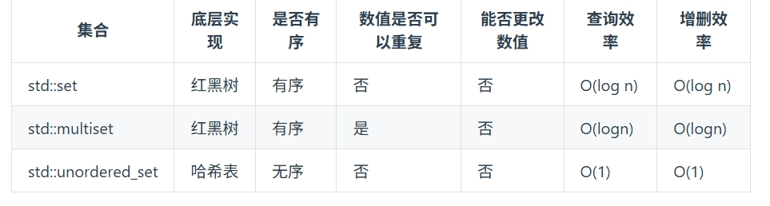
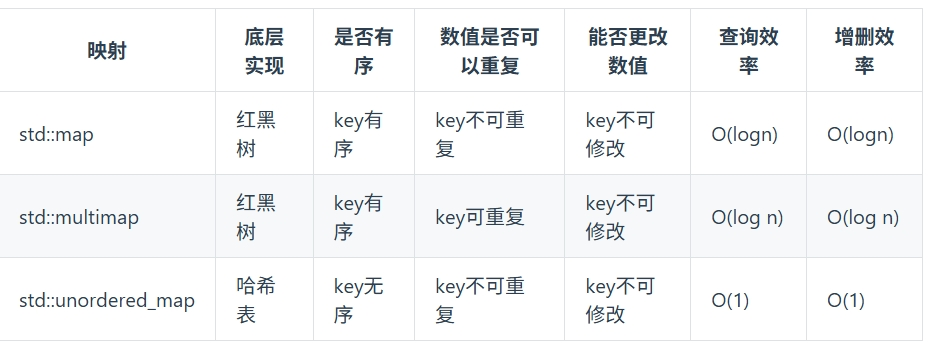

# 哈希表

## 解决的主要问题

一般哈希表都是用来快速判断一个元素是否出现集合里  
首先我再强调一下 **什么时候使用哈希法**，当我们需要查询一个元素是否出现过，或者一个元素是否在集合里的时候，就要第一时间想到哈希法。
  
  

## 有效的字母异位词  

### 思路

- 用哈希表存储每个单词的字母和出现次数（键-数值（char - 'a'）, 值-出现次数）
- 遍历每个单词，将每个单词的字母和出现次数存入哈希表
- 遍历第二个单词，将每个单词的字母出现进行删除
- 遍历哈希表，若出现次数不为零，则返回false
- 若遍历完所有单词，则返回true

```cpp
class Solution {
public:
    bool isAnagram(string s, string t) {
        int record[26] = {0};
        for(int i = 0;i < s.size();i++){
            record[s[i] - 'a']++;
        }
        for(int i = 0;i < t.size();i++){
            record[t[i] - 'a']--;
        }
        for(int i = 0;i < 26;i++){
            if(record[i] != 0){
                return false;
            }
        }
        return true;
    }
};
```  

## 字母异位词分组

### 字母异位词分组思路

- 构建一个哈希表键值对，其中键为已经排好序的字符串， 值为字符串（未排序）
- 遍历字符串，由于哈希表的键的唯一性，遍历哈希表的键，然后依次加入到结果当中

```cpp
class Solution {
public:
    vector<vector<string>> groupAnagrams(vector<string>& strs) {
        unordered_map<string, vector<string>> anagramMap; // 创建哈希表
        for (const string& str : strs) {
            string tmp = str;
            sort(tmp.begin(), tmp.end());
            anagramMap[tmp].push_back(str);
        }
        vector<vector<string>> ans;
        for (const auto& pair : anagramMap) {
            ans.push_back(pair.second); // 将每组异位词加入到结果中
        }
        return ans;
    }
};
```

### 思路2

- 构建一个哈希表键值对，其中键为26个小写字母后跟出现次数， 值为字符串（未排序）
- 根据键的唯一性，依次添加到answer里面

```cpp
class Solution {
public:
    vector<vector<string>> groupAnagrams(vector<string>& strs) {
        unordered_map<string,vector<string>> map;
        for(string str:strs) {
            int counts[26] = {0};
            for(char c:str) {
                counts[c-'a']++;
            }
            string key = "";
            for(int i = 0;i<26;++i) {
                if(counts[i]!=0) {
                    key.push_back(i+'a');
                    key.push_back(counts[i]);
                }
            }
            map[key].push_back(str);
        }
        vector<vector<string>> res;
        for(auto& p:map) {
            res.push_back(p.second);
        }
        return res;
    }
}; 
```  

## 两个数组的交集

### 两个数组的交集思路

#### 思路1自行探索思路

- 创建一个从0-9的键值对，键为0-9，值为出现次数
- 然后依次遍历第一个数组，将每个元素的出现次数加1
- 然后依次遍历第二个数组，将每个元素的出现次数减1
- 最后遍历哈希表，若出现次数为0，则加入到结果中  
- 输出的交集一定是不重复的唯一值（**错误思路**）

### 思路2题解

- 创建一个set哈希表，是为了给结果进行去重
- 创建一个哈希表，将第一个数组存入
- 遍历第二个数组，若该数组在哈希表内，则加入到结果中
- 返回类型是vector\<int\>，因此将哈希表转换为vector\<int\>结构

```cpp
class Solution {
public:
    vector<int> intersection(vector<int>& nums1, vector<int>& nums2) {
        unordered_set<int> result_set;
        unordered_set<int> num_set(nums1.begin(),nums1.end());
        for(int num : nums2){
            if (num_set.find(num) != num_set.end()){
                result_set.insert(num);
            }
        }
        vector<int> result_vector(result_set.begin(),result_set.end());
        return result_vector;
    }
};
```

## 两个数组的交集II

### 两个数组的交集II思路

- 将最小的数组设置为第一个，如果不是，则交换两个数组
- 创建一个哈希表，将第一个数组存入（键 ： 数字 值 ： 出现次数）
- 遍历第二个数组，若该数组在哈希表内，则将该数字加入到结果中，并且将该数字的出现次数减1
- 如果值为零，则将该数字从哈希表中删除
- 最后返回结果

```cpp
class Solution {
public:
    vector<int> intersect(vector<int>& nums1, vector<int>& nums2) {
        if (nums1.size() > nums2.size()) {
            return intersect(nums2, nums1);
        }
        unordered_map <int, int> m;
        for (int num : nums1) {
            ++m[num];
        }
        vector<int> intersection;
        for (int num : nums2) {
            if (m.count(num)) {
                intersection.push_back(num);
                --m[num];
                if (m[num] == 0) {
                    m.erase(num);
                }
            }
        }
        return intersection;
    }
};
```

## 快乐数

### 快乐数思路

- 定义一个函数，输入一个整数，返回每一位数字的平方和
- 将输入的整数进行运算，如果是1，则返回true
- 如果不是，则看是否出现过，如果出现过，则返回false
- 如果没有出现过，则将该值存入哈希表
- 重复上述步骤，直到得到1或循环结束  

```cpp
class Solution {
public:
        int getSum(int n) {
            int sum = 0;
            while (n) {
                sum += (n % 10) * (n % 10);
                n /= 10;
            }
            return sum;
        }
    bool isHappy(int n) {
        unordered_set<int> dic;
        while (1) {
            int sum = getSum(n);
            if (sum == 1) {
                return true;
            }
            if (dic.find(sum) != dic.end()) {
                return false;
            } else {
                dic.insert(sum);
            }
            n = sum;
        }

    } 
};
```

## 三数之和

### 三数之和思路

先对数组进行排序
利用双指针方法先确定第一个值为nums[i]（若 num[i] > 0 直接break）
然后设置两个指针，左指针指向i+1，右指针指向nums.size() - 1
循环  
若小于零，左指针+1，若大于零，右指针-1
若等于零，则将结果加入到结果
去重操作： 判断num[i] == num[i-1],若相等则跳过。
对于收获逻辑的步骤中，当遇到和为零时，可能left 与 left+1的值也相等（right 与 right - 1的值也相等）因此要做一个while语句的循环处理

```cpp
class Solution {
public:
    vector<vector<int>> threeSum(vector<int>& nums) {
        vector<vector<int>> result;
        sort(nums.begin(),nums.end());
        for (int i = 0;i < nums.size();i++){
            if (nums[i] > 0){
                return result;
            }
            if (i > 0 && nums[i] == nums[i - 1]){
                continue;
            }
            int left = i + 1;
            int right = nums.size() - 1;
            while (right > left){
                if (nums[i] + nums[right] + nums[left] > 0){
                    right--;
                }else if(nums[i] + nums[right] + nums[left] < 0){
                    left++;
                }else{
                    result.push_back(vector<int>{nums[i],nums[left],nums[right]});
                    while(right > left && nums[right] == nums[right - 1]) right--;
                    while(right > left && nums[left] == nums[left + 1]) left++;
                    right--;
                    left++;
                }

            }
        }
        return result;
    }
};
```

## 四数相加Ⅱ

### 四数相加II思路
