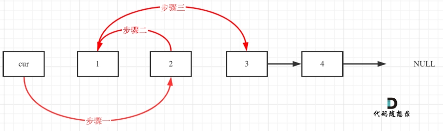
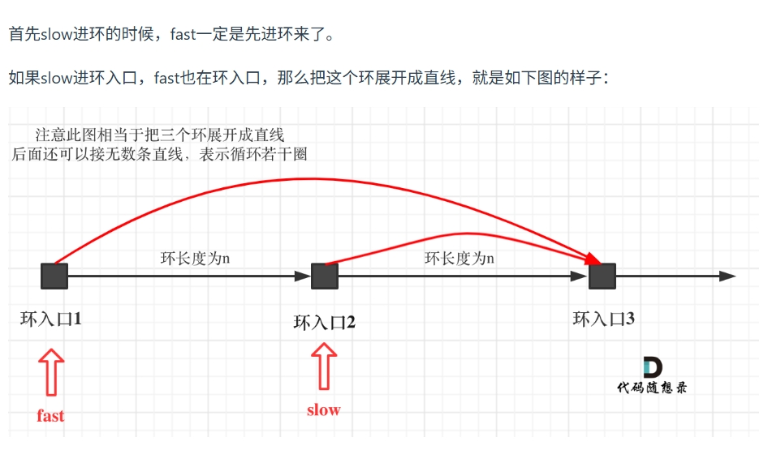

# 链表

## 两两交换链表中的节点

### 思路

创建虚拟头节点，省去对与头节点的特殊操作  
首先要知道两个需要交换位置的前一个节点，即将cur节点定位到所交换两个节点的前一个节点；然后定义两个临时节点，去保存信息，按照一定顺序从前往后替换  
首先将cur的下一个节点指向第二个节点，然后将第二个节点的next指向第一个节点，其次将第一个节点的next指向第二个节点的next（临时变量tmp_back）
最后返回虚拟头节点的下一个节点，即链表的头节点。  将虚拟头节点删除，防止内存管理混乱  
  

```cpp
class Solution {
public:
    ListNode* swapPairs(ListNode* head) {
        ListNode* dummyHead = new ListNode(0); // 设置一个虚拟头结点
        dummyHead->next = head; // 将虚拟头结点指向head，这样方便后面做删除操作
        ListNode* cur = dummyHead;
        while(cur->next != nullptr && cur->next->next != nullptr) {
            ListNode* tmp = cur->next; // 记录临时节点
            ListNode* tmp1 = cur->next->next->next; // 记录临时节点

            cur->next = cur->next->next;    // 步骤一
            cur->next->next = tmp;          // 步骤二
            cur->next->next->next = tmp1;   // 步骤三

            cur = cur->next->next; // cur移动两位，准备下一轮交换
        }
        ListNode* result = dummyHead->next;
        delete dummyHead;
        return result;
    }
};  
```  

## 删除链表的倒数第n个节点

### 1. 思路

设置两个指针，一个指针先走n步，然后两个指针一起走，当第一个指针到达链表尾部时，第二个指针指向倒数第n个节点。  
删除倒数第n个节点，只需要将该节点的前一个节点的next指针指向该节点的next指针即可。  

```cpp
/**
 * Definition for singly-linked list.
 * struct ListNode {
 *     int val;
 *     ListNode *next;
 *     ListNode() : val(0), next(nullptr) {}
 *     ListNode(int x) : val(x), next(nullptr) {}
 *     ListNode(int x, ListNode *next) : val(x), next(next) {}
 * };
 */
class Solution {
public:
    ListNode* removeNthFromEnd(ListNode* head, int n) {
        ListNode* dummyHead = new ListNode(0);
        dummyHead->next = head;
        ListNode* fast = dummyHead;
        ListNode* slow = dummyHead;
        n++;
        while (n--) {
            fast = fast->next;
        }
        while (fast != nullptr) {
            slow = slow->next;
            fast = fast->next;
        }

        slow->next = slow->next->next;
        ListNode* result = dummyHead->next;
        delete dummyHead;
        return result;
        
    }
};
```

## 链表相交

### . 思路

两个链表相交，当两个链表相交时，将尾部对齐，依次从尾部开始遍历，若遍历次数超过最小的链表的长度且未找到交点，则终止返回0；

```cpp
/**
 * Definition for singly-linked list.
 * struct ListNode {
 *     int val;
 *     ListNode *next;
 *     ListNode(int x) : val(x), next(NULL) {}
 * };
 */
class Solution {
public:
    ListNode *getIntersectionNode(ListNode *headA, ListNode *headB) {
        ListNode* A = headA;
        ListNode* B = headB;
        int sizeA = 0, sizeB = 0;
        while (A != NULL) {
            A = A->next;
            sizeA++;
        }
        while (B != NULL) {
            B = B->next;
            sizeB++;
        }
        A = headA;
        B = headB;
        if (sizeA < sizeB) {
            swap(sizeA, sizeB);
            swap(A, B);
        }
        int gap = sizeA - sizeB;
        while (gap--) {
            A = A->next;
        }
        while (A != NULL) {
            if (A == B) {
                return A;
            }
            A = A->next;
            B = B->next;
        }
        return NULL;
    }
};
```

## 环形链表II

### 思路——快慢指针

设置两个指针，一个指针每次移动一步，另一个指针每次移动两步，当两个指针相遇时，相遇点即为环的入口。  
设到环的距离为x，相遇点到环的入口的距离为y，环内剩余距离为z。
则相遇时慢指针slow = x + y, 快指针fast = x + y + n*(y + z) = 2*(x + y) -- 为什么相遇时，慢指针只走了不到一圈
设置一个指针从头开始，一个指针从相遇点开始，两个指针一起移动，当两个指针相遇时，相遇点即为环的入口。  

  

```cpp
/**
 * Definition for singly-linked list.
 * struct ListNode {
 *     int val;
 *     ListNode *next;
 *     ListNode(int x) : val(x), next(NULL) {}
 * };
 */
class Solution {
public:
    ListNode *detectCycle(ListNode *head) {
        ListNode* fast = head;
        ListNode* slow = head;
        while (fast != NULL && fast->next != NULL) {
            slow = slow->next;
            fast = fast->next->next;
            if (slow == fast){
                fast = head;
                while(fast != slow) {
                    fast = fast->next;
                    slow = slow->next;
                }
                return slow;
            }
        }
        return NULL;
    }

};
```

## 重点  

**用虚拟头节点，可以省去对头节点的特殊操作，并且可以将链表的头节点删除，防止内存管理混乱。**  
**快慢指针是处理有序问题的首要idea**  
